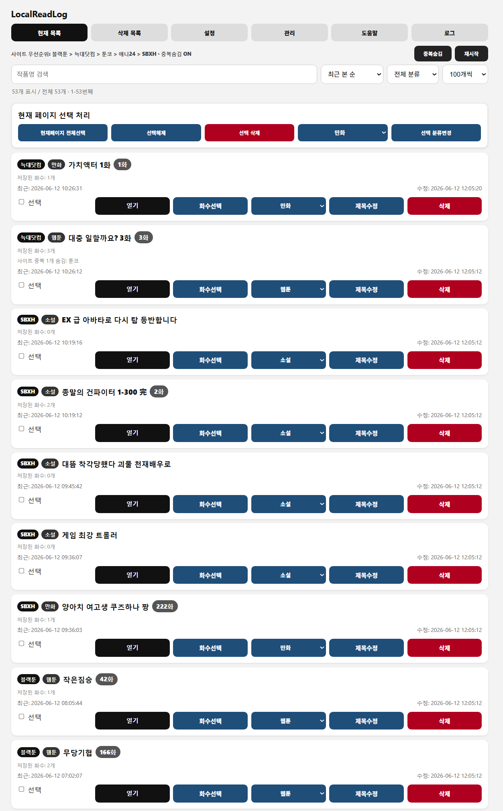
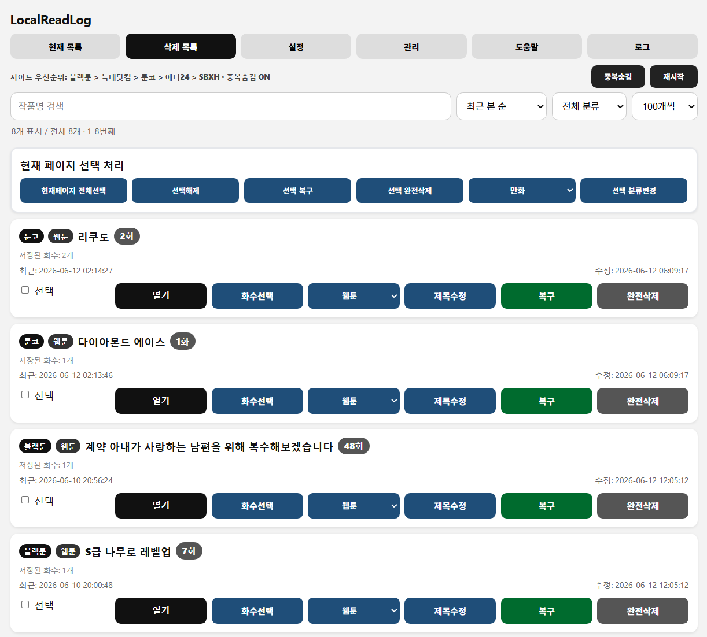
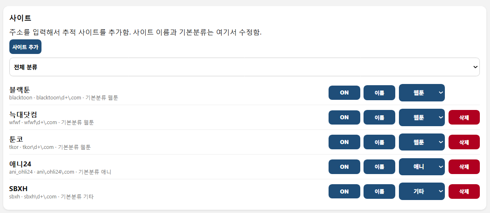
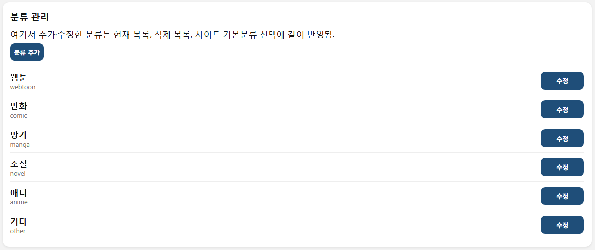
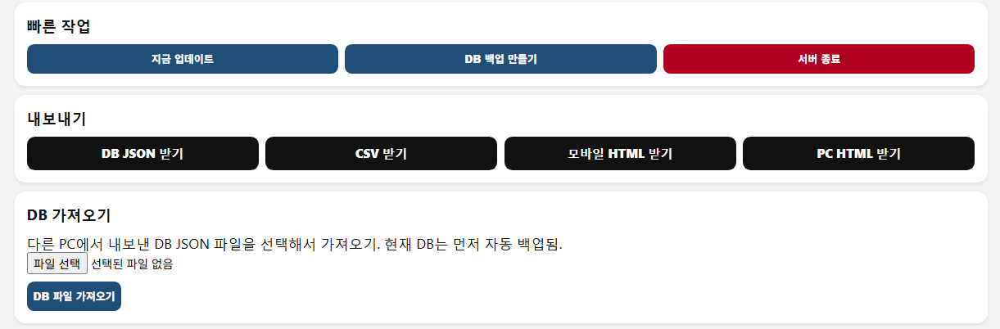

# LocalReadLog

Windows 로컬에서 브라우저 방문기록을 읽어 웹툰/만화/소설/애니 감상 기록을 정리하는 프로그램입니다.

- 전부 내 PC에서만 실행
- 별도 서버 전송 없음
- Chrome / Edge / Whale / Firefox 방문기록 지원
- 웹툰 / 만화 / 망가 / 소설 / 애니 / 기타 분류
- 화수 자동 인식, 부제목 표시 지원
- 사이트 추가, 사이트 ON/OFF, 분류 수정, 삭제/복구 지원

## 다운로드

최신 버전은 Releases에서 받을 수 있습니다.


## 화면 예시


### 현재 목록



현재 기록된 작품을 확인하고, 열기 / 화수선택 / 분류 / 제목수정 / 삭제를 할 수 있습니다.

### 삭제 목록



삭제한 항목을 확인하고, 복구하거나 완전삭제할 수 있습니다.

### 설정 - 사이트 관리



사이트 추가, 사이트 ON/OFF, 사이트명 수정, 기본 분류 변경, 사이트 우선순위 조정이 가능합니다.

### 설정 - 분류 관리



웹툰 / 만화 / 망가 / 소설 / 애니 / 기타 같은 분류를 추가하거나 이름을 수정할 수 있습니다.

### 관리 화면



백업, 내보내기, 정리 같은 관리 기능을 사용할 수 있습니다.


## 1. 먼저 압축 풀기

ZIP 안에서 바로 실행하지 마세요.

권장 위치:

```text
C:\LocalReadLog
```

압축을 완전히 푼 뒤 아래 실행 파일을 사용하세요.

## 2. Python 확인

PowerShell에서 확인합니다.

```powershell
python --version
```

`Python 3.x.x`가 나오면 바로 실행하면 됩니다.

안 나오면 설치합니다.

```powershell
winget install -e --id Python.Python.3.12
```

설치 후 PowerShell을 닫고 다시 열어 `python --version`을 다시 확인하세요.

## 3. 실행 파일

| 할 일 | 실행 파일 |
|---|---|
| 백그라운드 실행 | `01_Start_Background.vbs` |
| 오류 확인용 실행 | `02_Run_With_Window_For_Error_Check.bat` |
| Windows 시작 시 자동 실행 등록 | `03_Enable_Start_With_Windows.bat` |
| 자동 실행 해제 | `04_Disable_Start_With_Windows.bat` |
| 서버 종료 | `05_Stop_Server.bat` |
| 모바일 접속 방화벽 허용 | `06_Allow_Mobile_Access_Windows_Firewall.bat` |
| 방화벽 허용 규칙 제거 | `07_Remove_Mobile_Access_Windows_Firewall.bat` |

`01_Start_Background.vbs`를 실행하면 `core/localreadlog_start_notice.html` 안내 페이지가 먼저 열립니다.
이 페이지는 시작 알림용입니다. 서버가 준비되면 관리 화면이 따로 자동으로 열립니다.

서버가 자동으로 열리지 않으면 `02_Run_With_Window_For_Error_Check.bat`를 실행해서 오류를 확인하세요.

## 4. 접속 주소

PC에서 열기:

```text
http://127.0.0.1:8787
```

8787이 안 열리면 아래 주소도 확인하세요.

```text
http://127.0.0.1:8877
http://127.0.0.1:18787
http://127.0.0.1:28787
```

모바일에서 보려면 PC와 휴대폰이 같은 Wi-Fi에 있어야 합니다. 서버 화면의 `설정` 탭에 표시되는 **모바일 추천 주소**를 휴대폰 브라우저에서 열면 됩니다.

모바일 접속이 안 되면 `06_Allow_Mobile_Access_Windows_Firewall.bat`을 관리자 권한으로 실행하세요.

## 5. 주요 기능

- Whale / Edge / Chrome / Firefox 방문기록 스캔
- 작품별 최신 화수 관리
- 화수/장/회/챕터 번호가 없으면 제목의 부제목을 화수 칸에 표시함
- 웹툰 / 만화 / 망가 / 소설 / 애니 / 기타 분류
- 사이트 ON/OFF 및 우선순위 설정
- 브라우저 ON/OFF 설정
- 모바일 접속 지원
- 접속 비밀번호 ON/OFF
- GitHub Releases 기준 프로그램 업데이트 확인
- 시작 안내 페이지 표시
- 모바일 주소 조회 시 PowerShell 네트워크 조회 사용 안 함
- DB 백업 / 복원 / 가져오기 / 내보내기
- CSV / HTML 내보내기
- 백그라운드 실행 및 Windows 시작 시 자동 실행

## 6. 프로그램 자동 업데이트 설정

v0.1.29부터 GitHub Releases 기준 프로그램 자동 업데이트를 지원합니다.

처음 한 번만 프로그램 폴더의 `localreadlog_config.json`에 GitHub 저장소를 적어두면 됩니다.

```json
{
  "github_repo": "사용자명/저장소명",
  "program_auto_update_enabled": true,
  "github_asset_pattern": "LocalReadLog*.zip"
}
```

예시:

```json
{
  "github_repo": "szmahrh/LocalReadLog",
  "program_auto_update_enabled": true,
  "github_asset_pattern": "LocalReadLog*.zip"
}
```

사용 방법:

1. GitHub에서 새 Release를 만듭니다.
2. Release 파일에 `LocalReadLog-v0.1.30.zip`처럼 버전 ZIP을 올립니다.
3. 사용자가 `01_Start_Background.vbs`로 실행하면 시작 전에 최신 Release를 확인합니다.
4. 현재 버전보다 새 버전이면 `data/program_backups/`에 기존 파일과 주요 DB 파일을 백업한 뒤 업데이트합니다.

`data` 폴더와 `localreadlog_config.json`은 업데이트로 덮어쓰지 않습니다.

## 7. 데이터 저장 위치

실행 후 데이터는 `data` 폴더에 저장됩니다.

```text
data/localreadlog_db.json
data/localreadlog_latest.csv
data/localreadlog_latest_mobile.html
data/localreadlog_latest_pc.html
data/localreadlog_manager_log.txt
data/backups/
data/program_backups/
```

기존 DB를 쓰려면 `data/localreadlog_db.json`으로 넣으면 됩니다.

## 8. 보안 주의

LocalReadLog는 개인 PC와 로컬 네트워크용 도구입니다.

공유기 포트포워딩으로 외부 인터넷에 공개하지 마세요. 방문기록과 개인 DB가 노출될 수 있습니다.

모바일이나 다른 기기에서 접속할 때는 접속 비밀번호 사용을 권장합니다.

개인 데이터는 `data` 폴더에 저장됩니다. `.gitignore`에 포함되어 있으므로 저장소에는 소스 파일만 올리면 됩니다.

## 9. 삭제 방법

1. `05_Stop_Server.bat` 실행
2. `04_Disable_Start_With_Windows.bat` 실행
3. LocalReadLog 폴더 삭제

